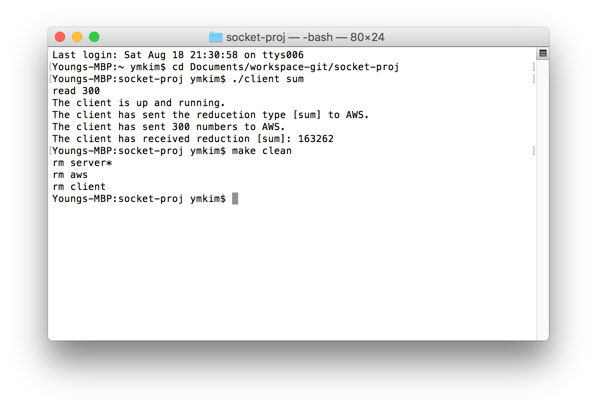
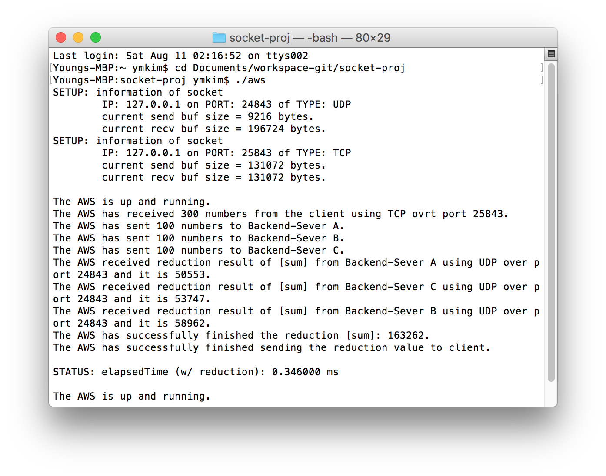
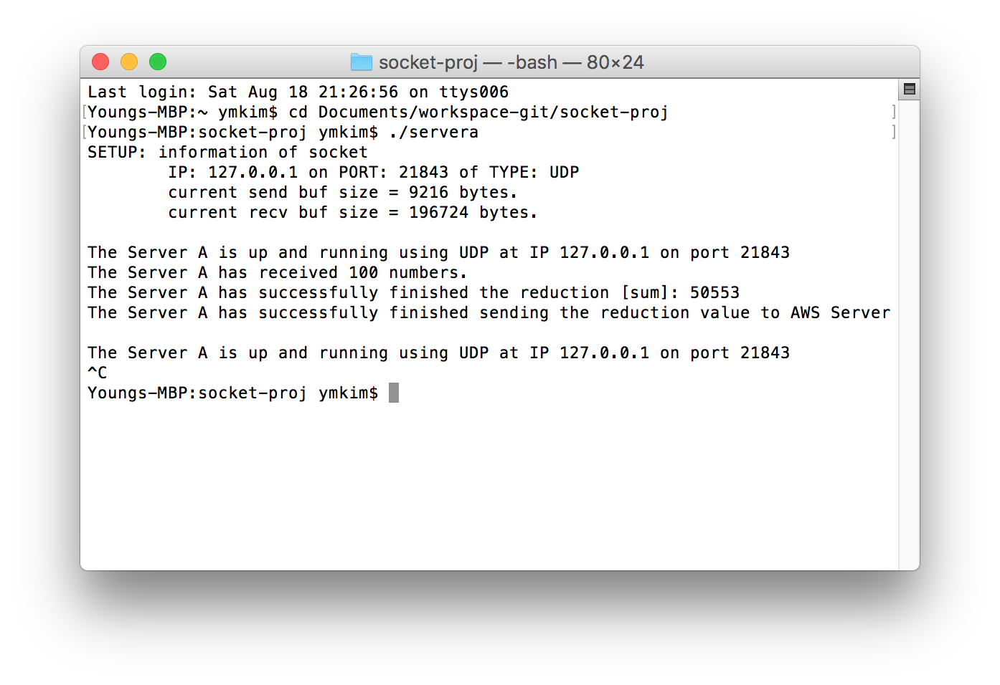

# socket-proj

## Socket Programming Project
* model of computational offloading where a client offloads computation to a server (AWS) via TCP 
* which in turn distributes the load over 3 backend servers via UDP
* similar to cloud-computing service (AWS) that implements MapReduce to speed up large computation task
* makefile included

### screenshot results on terminal

#### client calling function sum of 300 numbers

#### aws

#### server a

#### server b

#### server c
